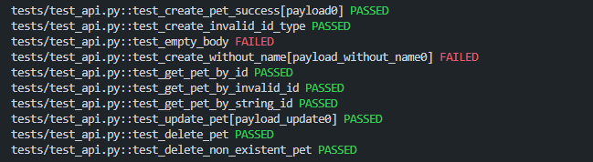

## API автоматизация (PetStore)

Автоматизированные тесты для REST API сервиса Swagger Petstore.

### Используемые технологии

* Python
* pytest
* requests
* REST API

### Тестируемый API
[Swagger Petstore](https://petstore.swagger.io/#/)

### Покрытые тестовые сценарии

#### Создание животного — `POST /pet`

**Позитивные сценарии**

- создание животного с валидными данными

**Негативные сценарии**

- создание животного с некорректным типом `id`
- отправка пустого тела запроса
- создание животного без обязательного поля `name`

**Проверки**

- статус-код ответа
- корректность имени животного
- корректность статуса животного


#### Получение животного — `GET /pet/{petId}`

**Позитивные сценарии**

- получение животного по существующему `id`

**Негативные сценарии**

- получение животного по несуществующему `id`
- получение животного по строковому `id`

**Проверки**

- статус-код ответа
- соответствие `id` в ответе


#### Обновление животного — `PUT /pet`

**Позитивные сценарии**

- обновление имени и статуса животного

**Проверки**

- статус-код ответа
- корректность `id`
- обновление имени
- обновление статуса


#### Удаление животного — `DELETE /pet/{petId}`

**Позитивные сценарии**

- удаление существующего животного

**Негативные сценарии**

- удаление несуществующего животного

**Проверки**

- статус-код ответа
- проверка отсутствия объекта после удаления

### Используемые подходы

* параметризация тестов (pytest.mark.parametrize)
* использование pytest fixtures
* разделение API методов и тестов (endpoint pattern)
* вынесение тестовых данных в отдельный модуль

### Установка зависимостей

```pip install -r requirements.txt```

### Запуск тестов

```pytest -v```

### Результат выполнения тестов

